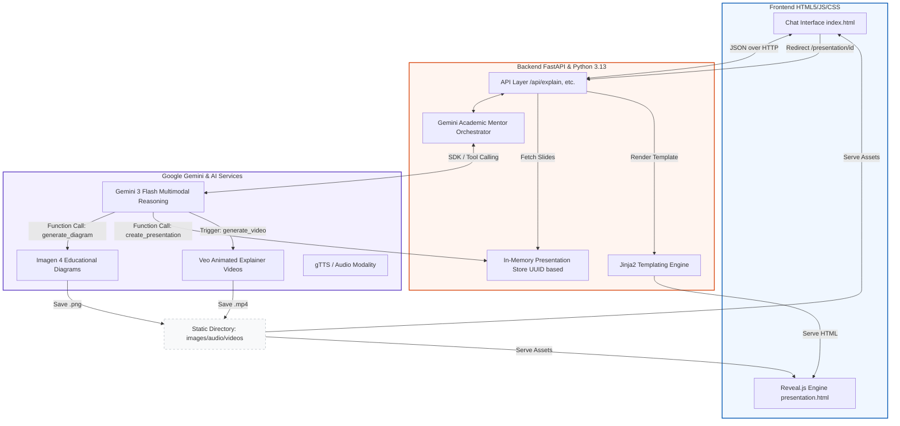

# GeminiLens System Architecture

The following diagram illustrates the flow of data and control within the GeminiLens platform, from the user's initial query to the generation of multimodal educational content.

## Key Technical Components:
1.  **FastAPI (Backend Orchestrator)**: Manages all API endpoints, handles the asynchronous generation cycles for video, and serves both the main chat and the dynamic presentation pages.
2.  **Gemini 3 Flash**: Acts as the brain of the system, determining when a student needs a diagram, a video, or an audio summary.
3.  **Tool Calling Pipeline**: 
    -   `generate_educational_diagram`: Real-time creation of diagrams using Imagen 4.
    -   `create_presentation_deck`: Aggregates conversation context into a structured JSON for Reveal.js.
4.  **Jinja2 + Reveal.js**: Modern stack for turning AI-generated JSON into highly interactive, web-based slide decks.
5.  **`uv` Deployment**: Using the `uv` package manager for lightning-fast container builds and deployment on **Google Cloud Run**.
