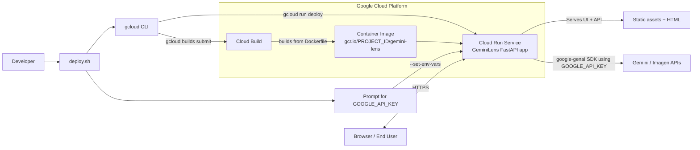

# GeminiLens: The Interactive Educational Explainer

GeminiLens is an adaptive AI teacher that explains complex concepts using text and dynamically generated educational diagrams. It uses the new `google-genai` SDK with Gemini 3 Flash and Imagen 4 via Function Calling.

## Prerequisites

- [uv](https://github.com/astral-sh/uv) (Extremely fast Python package installer and resolver)
- Python 3.13+
- A Google Cloud API Key with access to Vertex AI / Gemini API.

## Installation

1. Copy the environment variables template and set your API key:
   ```bash
   cp .env.example .env
   # Edit .env and add your GOOGLE_API_KEY
   ```

2. Install dependencies and run the application using `uv`:
   ```bash
   uv run uvicorn main:app --reload
   ```

3. Open your browser and navigate to `http://127.0.0.1:8000`.

## Deployment to Google Cloud Run

To deploy this application seamlessly to Google Cloud Run, we have included an automated script.

1. Ensure you have the `gcloud` CLI installed and authenticated (`gcloud auth login`).
2. Make the script executable:
   ```bash
   chmod +x deploy.sh
   ```
3. Open `deploy.sh` and update the `PROJECT_ID` variable with your Google Cloud Project ID.
4. Run the script:
   ```bash
   ./deploy.sh
   ```
5. The script will ask for your `GOOGLE_API_KEY` to securely pass it as an environment variable to the Cloud Run container. Once done, it will output the live URL.

## Architecture Diagram

The diagram below reflects the current Google Cloud deployment flow implemented by `deploy.sh`.



For a deeper view of the internal application flow, see `ARCHITECTURE.md`.